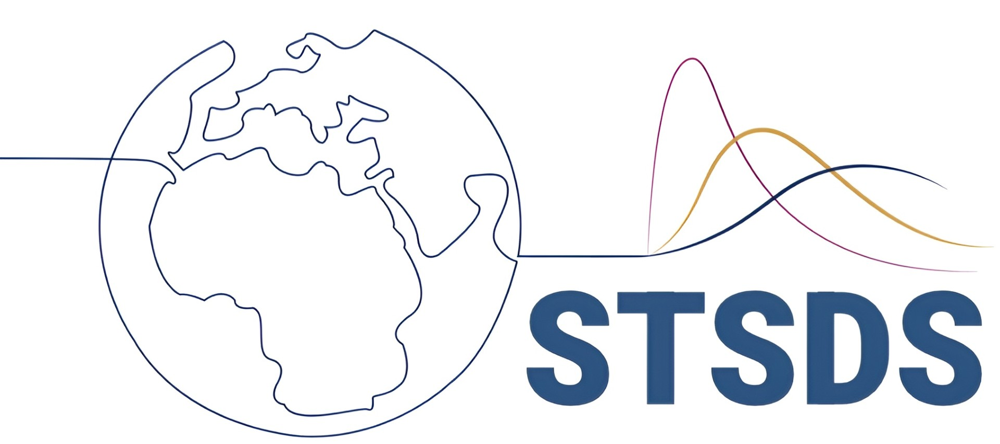

## International Conference on Statistics, Data Science, and Computing for the Environment and Climate Change 2026

The **LACSC–TIES–EnviBayes–EnvrASA 2026** conference brings together researchers in statistics, data science, and computing for the environment and climate change. The meeting is jointly organized by UNAM, IASC–LARS, AME, TIES, **EnviBayes (ISBA)**, and ENVR (ASA).

- **When:** 7–11 December 2026  
- **Where:** Mexico City, Mexico  

{fig-alt="LACSC–TIES–EnviBayes–EnvrASA 2026 conference" fig-align="left" width="480"}

Details and participation information:

- Conference site: [amestad.mx/lacsc-ties-envibayes-envrasa-2026](https://www.amestad.mx/lacsc-ties-envibayes-envrasa-2026)
- Call for papers (IASC–ISI notice): [Call for papers — LACSC–TIES–EnviBayes–EnvrASA 2026](https://iasc-isi.org/2026/02/08/call-for-papers-of-the-lacsc-ties-envibayes-envrasa-2026/)

## EnviBayes × STSDS webinar 2026

{fig-alt="STSDS — Spatio-Temporal Statistics & Data Science" fig-align="left" width="280"}

EnviBayes is partnering with [STSDS (Spatio-Temporal Statistics & Data Science)](https://www.stsds.org/) to organize a webinar as part of the STSDS international seminar series. Details will be announced here — stay tuned!

## EnviBayes Workshop on Complex Environmental Data 2025

{fig-alt="EnviBayes Workshop on Complex Environmental Data 2025" fig-align="left" width="480"}

The Department of Statistics at Texas A&M University hosted the 2025 EnviBayes Workshop on Complex Environmental Data, bringing together researchers working on environmental challenges and Bayesian statistics.

- **When:** 29–31 October 2025  
- **Where:** Texas A&M University, College Station, TX  

The workshop featured three plenary talks, 21 invited presentations, contributions from EnviBayes Student Paper Award winners, and a poster session. Sessions covered scalable Bayesian methods, remote sensing, air pollution modeling, ecological forecasting, and related topics.

- Event listing: [Texas A&M University calendar](https://calendar.tamu.edu/event/358019-envibayes-workshop-on-complex-environmental-data-2025)
- Recap: [EnviBayes Workshop at Texas A&M — College of Arts and Sciences](https://artsci.tamu.edu/news/2025/12/envibayes-workshop-stat.html)

## Past events

For past events, see the [EnviBayes Meeting archive on bayesian.org](https://bayesian.org/category/meeting/sectionchapter-meeting/envibayes-meeting/).
